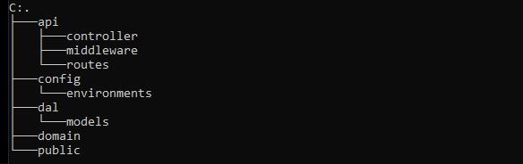
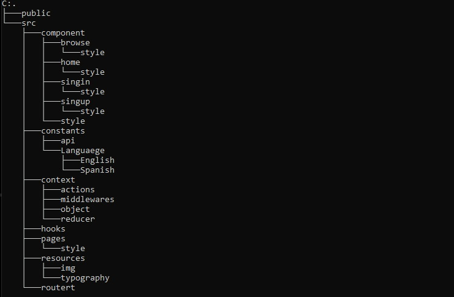

# `CLONE NETFLIX`

Clone Netflix an application based on the web giant Netflix.

the application is divided into two phases:

* The first is the auth_node server where the database, routers, among other parts that will be explained later are stored.

* The second is clone-netflix where the Create React App tool was used in this phase, technologies such as Redux were used to manage the context, React-Router as a router, among other technologies (more details will be given below).

## - **Server**
_____
    MongoDB, Mongoose, Express, Bcrypt, Babel technologies were used, among others, for the development of the backend.

### *Comados del servidor*
 Comand                        | Description                    
 :-                            | :-:                    
 start-dev | Start the development server.
 build | Compile the code through Babel.
 start | Start the production server.

.

### *Rutas del servidor*
    The application was created with the following routes: 

 Routes                        | URL                    
 :-                            | :-:                    
 Home                          | "/"                    
 Browse                        | "/browse"              
 Sing In                       | "/singin"              
 Sing Up Registration          | "/singup/registration" 
 Sing Up Form Create Account   | "/singup/regform"      
 Sing Up                       | "/singup"              
 Sing Up Choose Plan           | "/singup/planform"     
 Sing Up Payment               | "/singup/payment"      
 Sing Up Credit Option         | "/singup/creditoption" 
 User authentication           | "/auth/user"                     
 User add                      | "/singup/add"                     
 User is registered            | "/auth/isregister"                     
 Route 404 file not Found      | ""                     

    The Clean Architecture design pattern was used in addition to a layered architecture. The project tree was as follows:

### *Api Cap*

    In this layer, the communication of the data with the frontend is defined, it is in charge of working the data sent by the frontend and establishing a connection through the Controller with the Domain and Dal layer. It's divided in:

* Controller: establishes all the logic of the application, since as it is an extremely simple API, it was delegated part of the Domain functions, establishes the connection with the Dal and Domain Layers.
  
* Middleware: it is a sub-layer in charge of verifying data and HTTP security protocols for the authentication of users, in total there are three:
  
  1. authUser.middleware: Checks for the existence of the x-access-token header.

  2. verifEmail.middleware: Verifies the correct writing of the Email, its existence and its type, the same with the password.
   
  3. verifUser.middleware: Its existence is the same as verifEmail only a little more complex.

* Routes: contains the user's authentication and registration paths.

### *Config Cap* 

    It contains the configuration of the server and the database as well as the use of the project environment variables.

### *Dal Cap*

    It is in charge of establishing the data model and thus connecting the database.

## *View*
----
    Like the server, a Clean Architecture design pattern is followed but not beyond structuring the project. Technologies such as React, Redux, React-Router, Axios and others were used. The tree of view is structured as follows:

In addition, the Api The movie Data Base was used to acquire the contents and information of the different movies and series of the moment.

#### *You are invited to clone the repository and interact with the application.*